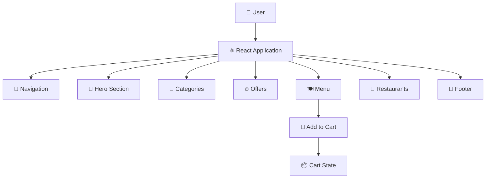

🍔 SWIGGY — FOOD DELIVERY UI

A modern food delivery web interface inspired by popular food ordering platforms, built with React.js. The application presents food categories, promotional offers, menu items and restaurant listings through a clean, component-based user interface.

━━━━━━━━━━━━━━━━━━━━━━━━━━━━━━━━━━━━

✨ FEATURES

🍕 Food Categories
Explore popular food categories through visually engaging category cards.

🔥 Offers & Deals
Display promotional offers and featured deals in dedicated sections.

🍽️ Interactive Menu
Browse food items with images, descriptions and prices.

🛒 Add to Cart
Add menu items to the cart through an interactive button.

🏪 Restaurant Listings
Explore restaurants with cuisine, ratings and estimated delivery information.

🎯 Reusable UI Components
Organized interface elements into reusable React components.

📱 Responsive Interface
Designed with flexible layouts for a smooth experience across screen sizes.

━━━━━━━━━━━━━━━━━━━━━━━━━━━━━━━━━━━━

🛠️ TECHNOLOGY STACK

⚛️ React.js
🟨 JavaScript
🎨 CSS3
📦 npm
🧩 React Components
🌐 HTML5

━━━━━━━━━━━━━━━━━━━━━━━━━━━━━━━━━━━━

🏗️ APPLICATION ARCHITECTURE



━━━━━━━━━━━━━━━━━━━━━━━━━━━━━━━━━━━━

🔄 HOW IT WORKS

① Explore
Users enter the application and browse the main food delivery interface.

② Discover
Food categories and promotional offers help users explore available options.

③ Browse Menu
Menu cards display food images, descriptions and pricing information.

④ Add Items
Users can add selected food items to the cart through the interactive menu.

⑤ Explore Restaurants
Restaurant cards provide cuisine information, ratings and estimated delivery times.

━━━━━━━━━━━━━━━━━━━━━━━━━━━━━━━━━━━━

📂 PROJECT STRUCTURE

```text
Swiggy/
│
├── public/
│
├── src/
│   ├── components/
│   │   ├── Categories.js
│   │   ├── Categories.css
│   │   ├── Footer.js
│   │   ├── Footer.css
│   │   ├── Hero.js
│   │   ├── Hero.css
│   │   ├── MenuCard.js
│   │   ├── MenuCard.css
│   │   ├── Navbar.js
│   │   ├── Navbar.css
│   │   ├── Offers.js
│   │   ├── offers.css
│   │   ├── Restaurants.js
│   │   └── Restaurants.css
│   │
│   ├── App.js
│   ├── App.css
│   ├── index.js
│   └── index.css
│
├── package.json
└── README.md
```

━━━━━━━━━━━━━━━━━━━━━━━━━━━━━━━━━━━━

🧠 CONCEPTS DEMONSTRATED

⚛️ React Functional Components
🔄 React State Management
🧩 Component-Based Architecture
📦 Props & Data Passing
🔀 Dynamic Rendering with Map
🖱️ Event Handling
🛒 Cart State Management
🎨 CSS Styling
📱 Responsive Layout Design
♻️ Reusable UI Components
🗂️ Structured Frontend Organization

━━━━━━━━━━━━━━━━━━━━━━━━━━━━━━━━━━━━

💡 PROJECT HIGHLIGHTS

🍔 Developed a component-based food delivery interface using React.js.

🧩 Created reusable components for navigation, categories, offers, menu items, restaurants and footer sections.

🛒 Implemented interactive cart functionality using React state.

📊 Rendered menu and restaurant information dynamically from structured data.

🎨 Designed dedicated styling for individual UI sections to maintain a consistent visual experience.

📱 Built a responsive frontend layout suitable for different screen sizes.

━━━━━━━━━━━━━━━━━━━━━━━━━━━━━━━━━━━━

🚀 FUTURE ENHANCEMENTS

🔎 Restaurant & Food Search
🗂️ Category Filtering
🛒 Dedicated Cart Page
💳 Checkout Experience
👤 User Authentication
📍 Location-Based Restaurant Discovery
📦 Order Tracking
💾 Persistent Cart Data
🌐 Backend & Database Integration

━━━━━━━━━━━━━━━━━━━━━━━━━━━━━━━━━━━━

🍔 EXPLORE → DISCOVER → ORDER


